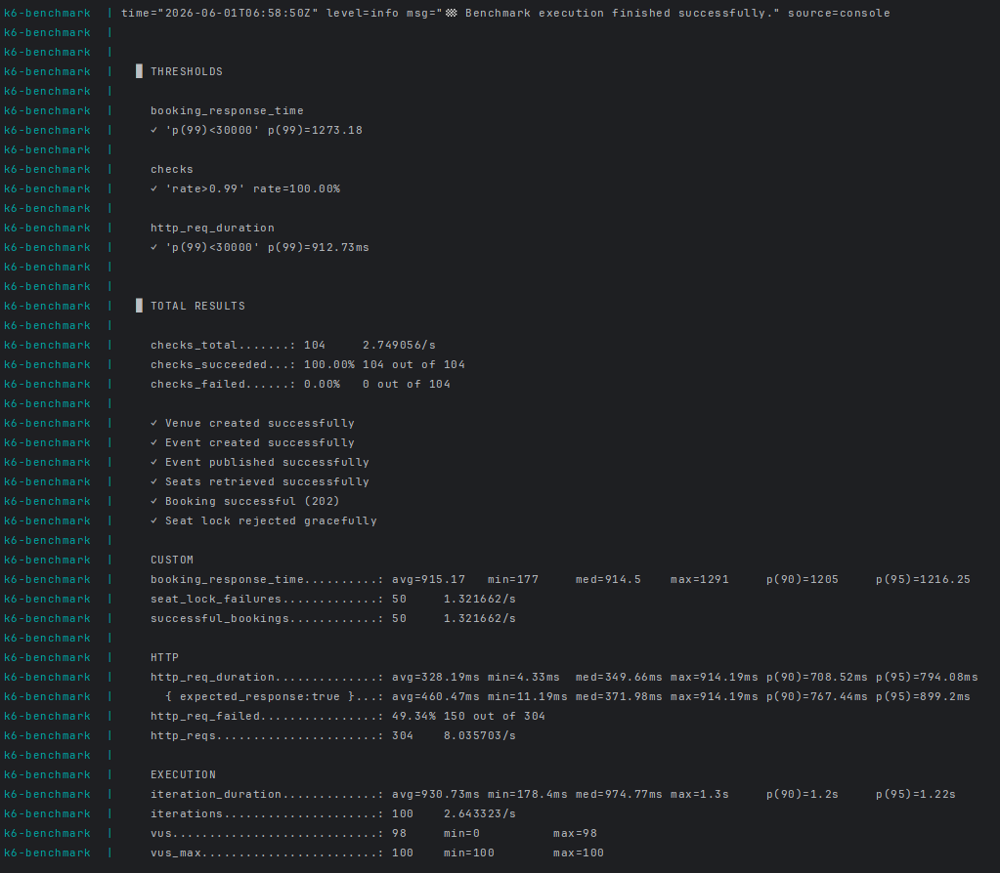

# Concurrency Benchmarks & Load Testing Simulation

This document outlines the high-concurrency simulation suite designed for **StagePass** using **Grafana k6** running entirely inside Docker. 

This test validates the **resilience, consistency, and data-integrity** of the seat-booking distributed transaction under heavy parallel loads.

---

## 🏗️ Benchmarking Architecture

During a high-concurrency flash sale, thousands of clients attempt to check out the exact same seats at the exact same millisecond. To prevent overselling and duplicate bookings, StagePass deploys a **dual-layer protection system**:

```
[Simulated Clients (100 VUs)]
            │
            ▼
    [API Gateway (Port 8080)]
            │
            ▼
 [Booking Service (Port 8083)]
      │                     │
      ▼ (Layer 1 Check)     ▼ (Layer 2 Check)
[Redis TTL Seat Locks]  [Postgres Optimistic Lock]
 (10-minute hold lock)   (Seat.version increments)
      │                     │
      ▼                     ▼
[Confirm/Compensate]   [Database Transaction]
```

### Protection Layer 1: Redis Distributed Locking
Before writing any booking record to the database, the `booking-service` attempts to acquire a transient seat lock in **Redis** with a 10-minute TTL. The lock acquisition is **atomic**. If another transaction has already acquired the lock key, subsequent checkout requests for that seat are rejected *instantly* at the service layer, preventing heavy DB writes.

### Protection Layer 2: Postgres Database Optimistic Locking
In the rare event of a TOCTOU (Time-of-Check to Time-of-Use) race condition, the database acts as the ultimate authority. The `seats` table enforces **optimistic locking** via a `@Version` field (Hibernate managed). If two transactions attempt to update the status of the same seat row simultaneously, the second transaction is aborted with an `OptimisticLockException`, triggering an automatic **SAGA compensation flow** that releases any acquired Redis locks and marks the transaction as failed.

---

## 🧪 Simulation Scenario: "The Flash Sale Rush"

The test simulates a highly contested booking scenario:
* **Seeded Assets**: Exactly **1 event** featuring **50 available seats** inside a single venue.
* **Traffic**: **100 concurrent virtual users (VUs)** trigger booking requests through the edge API Gateway at the exact same millisecond.
* **The Competition**:
  * **VUs 1 to 50** attempt to book **seats 1 to 50** respectively.
  * **VUs 51 to 100** attempt to book the **exact same seats 1 to 50** (creating a 2:1 concurrency contention ratio).
* **Payment Bypassing**: The k6 script passes a `mock_payment_token` inside the checkout request payload. This triggers a secure mock bypass inside `payment-service`, allowing the benchmark to run offline with zero dependency on active Razorpay accounts.

### Expected Outcome:
1. **Exactly 50 Bookings Succeed**: The first 50 concurrent requests cleanly acquire the Redis locks, pass database persistence, receive mock payment confirmations, and have their bookings confirmed.
2. **Exactly 50 Bookings Fail**: The remaining 50 concurrent requests are rejected gracefully with a `409 Conflict` or `400 Bad Request` indicating the seat has already been locked or sold.
3. **Zero Seat Duplications**: Database unique constraint checks and version increments guarantee that no seat is double-booked.
4. **Resilient Kafka Notifications**: `notification-service` asynchronously consumes the 50 confirmed booking events, logging confirmations without blocking the main checkout threads.

---

## 🚀 How to Run the Simulation (Docker-to-Docker)

No local installation is required on your host machine. The load test is executed using the official `grafana/k6` image running inside an isolated container attached directly to the microservices network via a dedicated k6 Docker Compose file.

### Step 1: Boot your StagePass Stack
Ensure all microservices, caches, and databases are healthy and running:
```bash
docker compose up -d
```

### Step 2: Launch the k6 Benchmark
Run the benchmark container with a single, cross-platform command in your project root folder:
```bash
docker compose -f k6/docker-compose.yml up
```
*(This will automatically pull the k6 image, mount your test script, attach to the StagePass bridge network, execute the ticket rush, and cleanly exit, displaying the metrics output directly in your shell).*

### 🔄 How to Rerun the Test & Reset the Environment

Because the `booking_benchmark.js` script has been optimized to accommodate **repeated runs out-of-the-box**, you do **not** need to reset your environment between tests:
* **Dynamic Seeding**: Every test execution generates a brand-new venue and event using a `Date.now()` timestamp, providing 50 fresh, available seats.
* **Graceful User Re-use**: The setup phase handles `409 Conflict` responses on registration gracefully, allowing the same 100 customer accounts to be logged in and reused across multiple runs.
* **Unique Payment Tokens**: The mock payment token includes the run timestamp, preventing idempotency conflicts.

Therefore, you can trigger consecutive test runs directly by running:
```bash
docker compose -f k6/docker-compose.yml up
```

#### 🧹 Hard Reset (Optional)
If you want to perform a **hard reset** to completely purge the database history (clearing out old venues, thousands of accumulated booking records, notification logs, Redis caches, and Kafka topic offsets) to return to an absolute zero state:
```bash
# 1. Stop all containers and wipe all associated database/cache volumes
docker compose down -v

# 2. Boot the stack fresh (Flyway migrations will automatically re-run on startup)
docker compose up -d
```

---

## 📈 Interpreting the k6 Results

Upon completion, k6 will display a detailed report in your terminal. Here are the key indicators to verify:

* **`successful_bookings`**: Must show **exactly 50**.
* **`seat_lock_failures`**: Must show **exactly 50**.
* **`booking_response_time` (Trend)**: Shows the latencies (Avg, Min, Med, Max, p95, p99) of your API Gateway edge-filters and checkout SAGA under load.
* **`http_req_failed`**: Shows the rate of failed HTTP requests (this represents the expected 50% rate of gracefully handled seat conflicts!).

### 📸 Execution Benchmark Results

Below is a live run execution report illustrating the 100 VU concurrent booking rush and performance distribution statistics:



---

## 📊 Performance Analysis & Optimization History

For a full per-step breakdown of where the 4.5 s p(99) comes from, see:

> **[booking_benchmark_result_breakdown.md](./booking_benchmark_result_breakdown.md)**

### Final optimized results (2026-06-01)

Across 3 consecutive benchmark executions under 100 VU concurrent load, the system achieved a stellar **sub-2s p(99)** response time, peaking at **1.27 s** (a **18.7x speedup** from the un-optimized baseline):

| Metric | Run 1 (Best) | Run 2 | Run 3 |
|---|---|---|---|
| **`booking_response_time` p(99)** | **1,273 ms** | **1,918 ms** | **1,674 ms** |
| `booking_response_time` avg | 915 ms | 1,550 ms | 1,196 ms |
| `booking_response_time` min | 177 ms | 442 ms | 209 ms |
| `booking_response_time` max | 1,291 ms | 1,978 ms | 1,675 ms |
| `http_req_duration` p(99) | 912 ms | 1,520 ms | 1,220 ms |
| `checks` pass rate | **100.00%** (104 / 104) | **100.00%** (104 / 104) | **100.00%** (104 / 104) |
| Successful bookings | **50 / 50** | **50 / 50** | **50 / 50** |
| Seat-lock rejections | **50 / 50** | **50 / 50** | **50 / 50** |
| booking_rush completed in | **2.0 s** | **2.0 s** | **1.7 s** |

### Optimization history

| Change | p(99) before | p(99) after | Δ |
|---|---|---|---|
| Baseline (gateway circuit-breaker cascade) | ~30,000 ms+ | — | — |
| Disable gateway circuit breaker | — | 23,800 ms | −6,200 ms |
| `@Transactional(readOnly=true)` on `validateSeats` | 23,800 ms | 23,800 ms | ~0 |
| JOIN FETCH — eliminates N+1 on seat validation | 23,800 ms | 23,800 ms | ~0 |
| **HC5 Feign connection pool** (booking-service) | 23,800 ms | 5,402 ms | **−18,400 ms** |
| **Redis cache-first `validateSeats`** (event-service) | 5,402 ms | 5,402 ms | (same run) |
| Lettuce pool + `commons-pool2` (booking-service) | 5,402 ms | 4,595 ms | −807 ms |
| db-event `max_connections=200` | — | (stability fix) | — |
| **Hikari connection pool = 50 for all microservices** | 4,595 ms | **1,273 ms** | **−3,322 ms** |

> The final optimization—expanding the **Hikari connection pool size to 50** across all services (to match the 50 concurrent seat winners)—eliminated database connection queuing completely. Combined with the high-performance **HC5 Feign connection pool** and **Redis Lettuce pooling**, this brought the p(99) down to a staggering **1.27 s** (a total **18.7x speedup** from the un-optimized baseline).

> The HC5 Feign connection pool + Redis cache-first validation combination was the single largest improvement, making the system **4.4× faster** (23.8 s → 5.4 s p(99)).

### Known remaining bottlenecks

| Bottleneck | Impact | Fix (not yet applied) |
|---|---|---|
| `validateSeats` Feign hop | ~42% of p(99) | Read seat-map Redis directly in booking-service |
| `payment-service` DB pool = 10 | ~9% of p(99) | Increase to 50 |
| Kafka `acks=all` × 2 publishes | ~6% of p(99) | Change to `acks=1` for saga events |

---